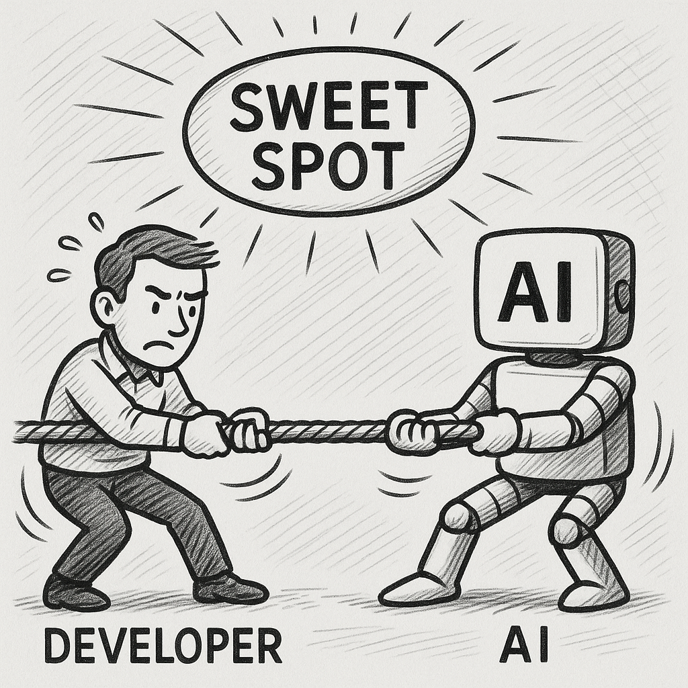

I was firmly planted in the anti-AI coding squad until about a month ago. I had
this aha-moment today that made some parts click for me. Before I get to that, I
have to give you some more context (almost feels like I'm prompting here).

I don't just love programming. I love writing really good code that
I can be proud of. Code that is better than the previous code I wrote. The feeling
when this turns into a system that hums night and day to solve something big is
just amazing.

Then this AI force started to flood the market, the socials, the blogs. It was
everywhere. The early adopters that didn't know how to code started building things
that they never before could without paying a developer. The hype got its own hype.

Bloodbath.

Then I saw a non-coder friend of mine build 80% of a new HMS with no coding
experience. It took him days, not months. It worked pretty well for a while, but
then the issues started appearing. He prompted for one fix but the code broke
somewhere else. The momentum stopped.

So I used to say. "You get started really quickly with AI, but you never finish.".

This all fits into my aha-moment, so bear with me here.

A good friend and great developer enticed me to try out Claude Code. He said he
had been sitting on the same fence as me for a long time, but it's time to really
give claude code a chance.

My speed of development drastically improved, and I started just hammering out
things I had planned to be working on for the next few weeks, in days.
It was such a rush. I felt like the world was now mine to take. Muhahahaha. What a great feeling!

Yesterday I decided to take one of my many ideas and start building it with AI.
On the side, while putting the kids to bed and hanging out with my girlfriend.
Time I normally just disconnect.

I made a solid plan with [superpowers](https://github.com/obra/superpowers-marketplace).
This usually gives me great results. The implementation plan ended up being about
1500 lines with examples of exactly how the program should be implemented. Exactly
what I needed for a quick MVP/concept.

I felt feisty, so I put it in YOLO mode and watched the output as it chugged along.
Thirty minutes later it told me that it was done.

When I opened the app, I just got errors.

Fine. I asked claude to take a look, and it fixed it. But another error hit. I asked
again, error, ask, error... So it continued and it felt like shit.

One of the core libraries that was used in this project had changed so much since
claudes training data, so it just guessed. I asked for it to check the docs, with
url to the docs, but it just didn't care.

Worst of all, I didn't know the docs of the library myself.

I went to bed, and today when I woke up, my aha-moment happened.

Picture this. Place your work in two different buckets

- Bucket 1: You have a list of work you need to get done. You already know the
  tech stack, the problem-space, the solution needed, and how to implement.
- Bucket 2: You are creating something new, with some tools you don't know yet,
  and are trying to figure out the problem-space and solution needed.

When I was enjoying bucket 1 for about a month, I was on cloud9 using AI.
It was almost like my fingers could type at 1 000 wpm. Perfect fit for claude code.

Then, when I was doing work that fits in bucket 2 I quickly felt the complete
opposite. It was slower, no joy, slow progress and I felt like shit.

Therefore, I hereby declare that I will be a good boy and ditch Claude Code when
I need to do things that are beyond my current scope of knowledge. If the picture
in my head of how the program will be written is less than 90% ready, then
claude code has to sit on the bench and watch me type slowly. It must endure that
pain, as I must endure the pain for letting it do the programming that I love
when it's bucket 1 work.
